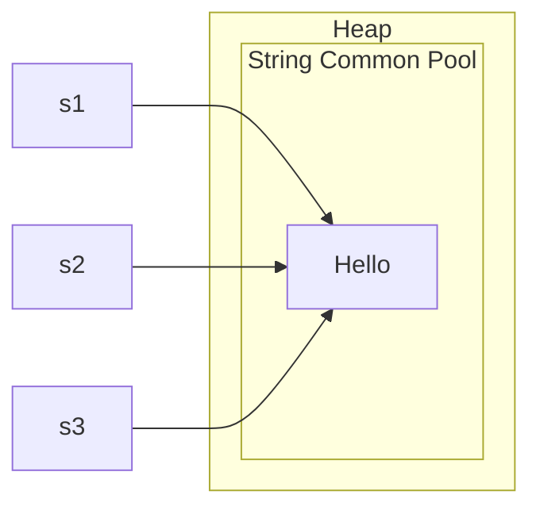
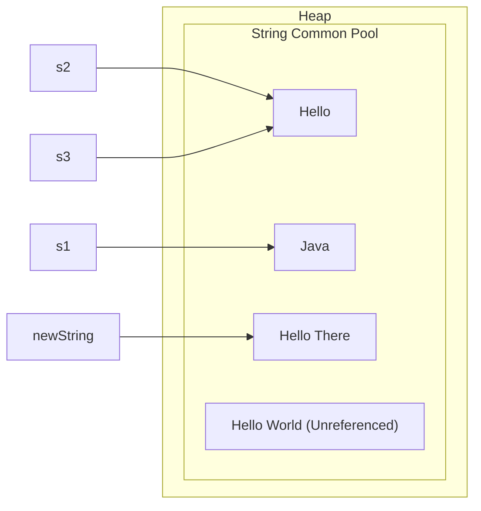

# Strings

## String in java: Introduction 

Two Ways to Construct Strings: 

- **String Literal:**
    - Example: `String message = "Hello there";`
    - When created this way, the string is stored in the String Constant Pool, which optimizes memory usage by reusing string literals.

- **Using New Keyword:**
    - Example: `String name = new String("ABCDEF");`
    - This method directly allocates memory for the string object in the Heap Memory, which can lead to more memory usage compared to string literals.

<h2> Why Are Strings Immutable? </h2>
<p> A string is an immutable object, meaning we cannot change it after creating the instance. It is similar to "final" primitive types. Whenever we modify a string, a new instance is created. </p>
<h2> String Methods: </h2>
`length(), substring(startIndex, endIndex), concat(string), charAt(index), equals(string), indexOf(substring), toUpperCase(), toLowerCase(), trim(), contains(substring)`




```java
    // Changing the value of s1
    s1 = "Java";
    
    // Updating with concat() operation
    s2.concat(" World");
    
    // The concatenated String will be created as a new instance
    // An object should refer to that instance to get the concatenated value.
    String newString = s3.concat("Hello There");
```



**Explanation**:

1. When s1 is assigned a new value, it references a new string instance, "Java." The original string "Hello" remains unchanged.
2. The concat() operation creates a new string instance without modifying the original string. In the case of s2.concat(" World"), the result is a new string "Hello World," but since it is not assigned to any variable, it becomes unreferenced.
3. On the other hand, newString is assigned the result of s3.concat(" There"), which means newString now points to the new string instance "Hello There."

<h2> StringBuilder in Java </h2>

- **Definition:** A `StringBuilder` is a mutable sequence of characters, allowing modification of strings without creating new objects. It is more efficient than `String` for concatenating multiple strings.

- **Common Methods:**
    - `append()`: Adds a string to the end.
    - `insert()`: Inserts a string at a specified position.
    - `delete()`: Removes a substring within a specified range.
    - `deleteCharAt()`: Removes the character at a specified index.
    - `reverse()`: Reverses the character sequence.
    - `replace()`: Replaces a substring with another string.
    - `length()`: Returns the length of the character sequence.

- **Advantages:** Using `StringBuilder` reduces memory usage and improves performance in scenarios with frequent string modifications.

- **Resources:** [TutorialKart: Java StringBuilder](https://www.tutorialkart.com/java/java-stringbuilder/)


<h6> String related questions to ask during interviews: </h6>
    1. Are there specific characters to consider (e.g., special characters, whitespace)?
    2. Is the string case-sensitive?
    3. What are the time and space complexity requirements?
    4. How large can the input string be?
    5. Are there limitations on operations I can use (e.g., no built-in string functions)?
    6. Can I modify the original string, or do I need to return a new string?
    7. Should the output maintain the order of characters from the original string?
    8. Are there multiple ways to solve this problem, or is there a preferred method?


